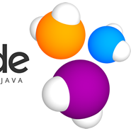
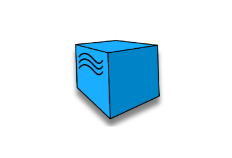
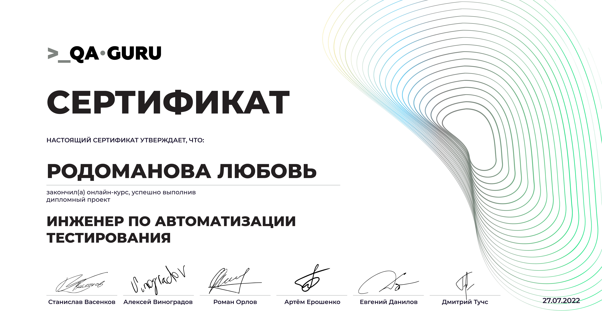
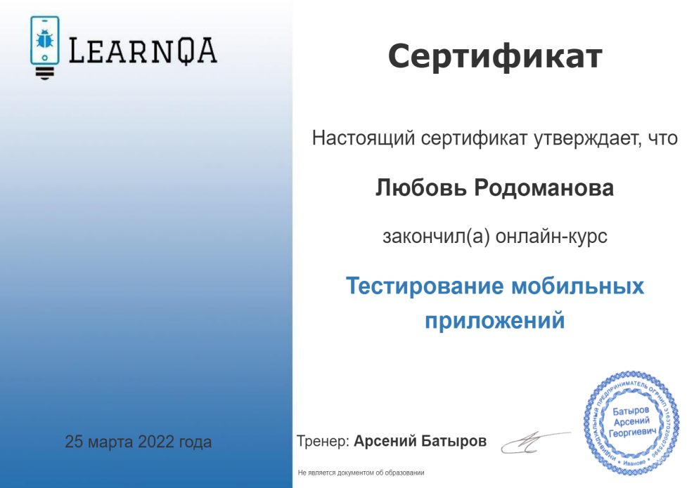
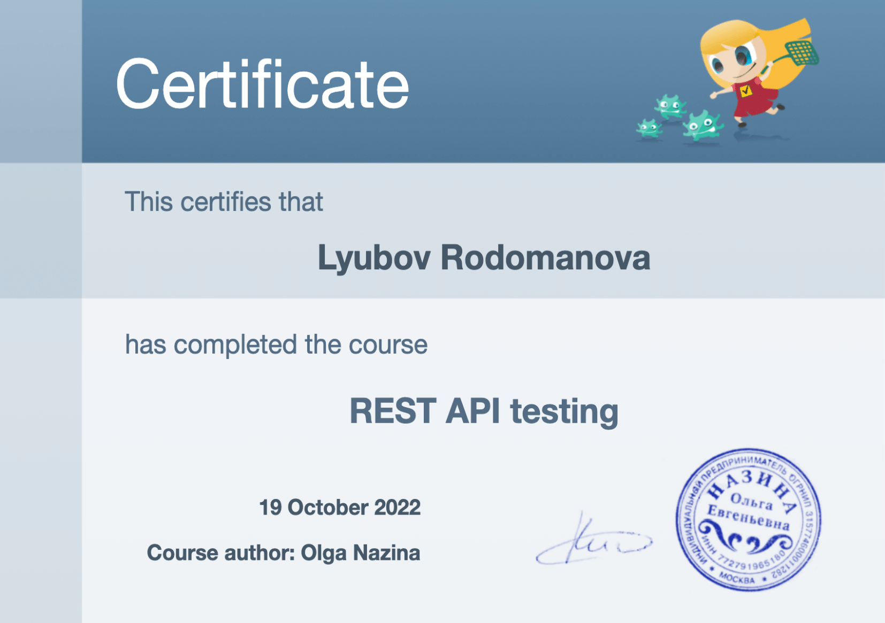
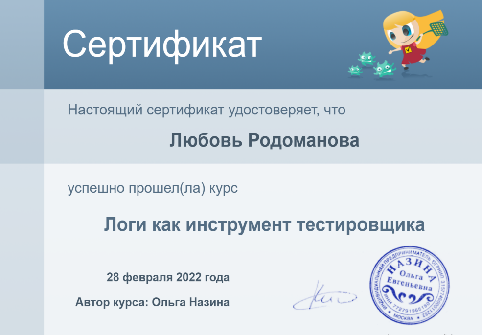
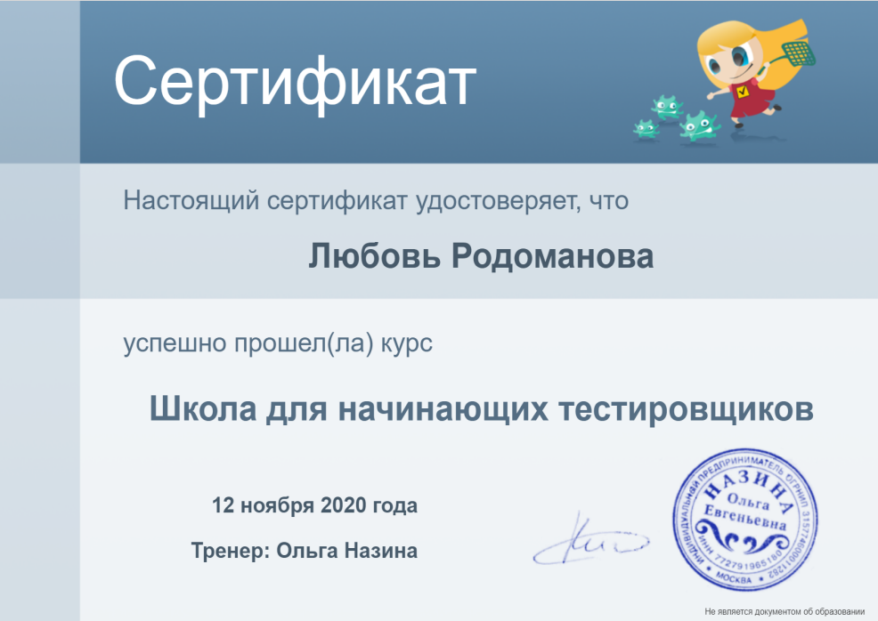
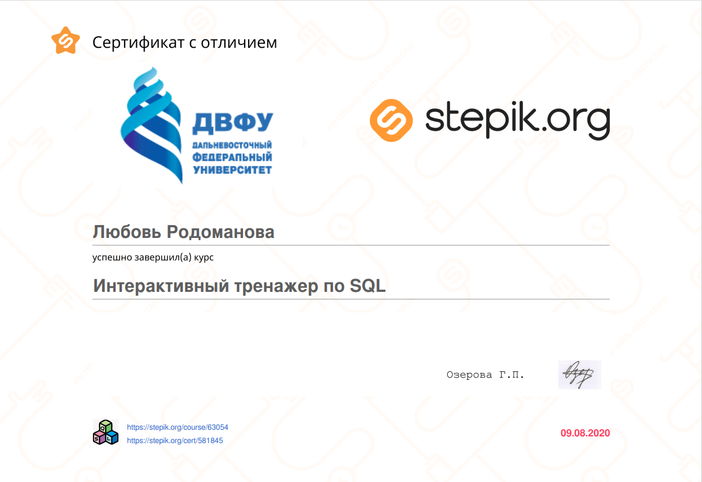
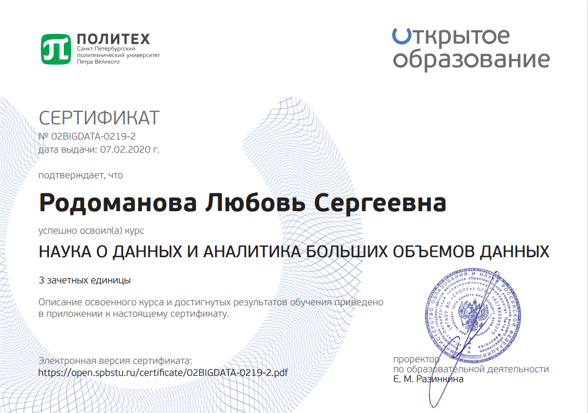
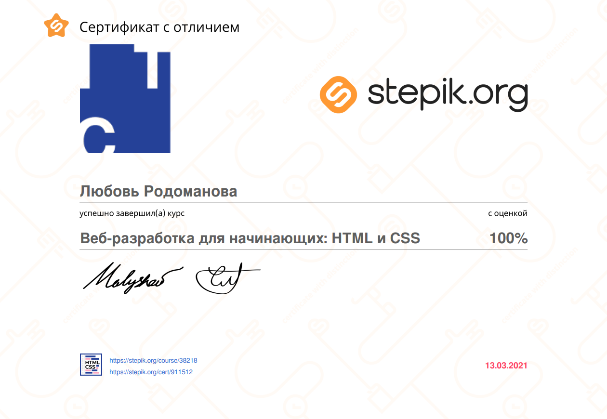

### Добро пожаловать! 👋
Меня зовут Любовь. Я - инженер по тестированию программного обеспечения. 

###  Инструменты:

  &nbsp;
  &nbsp;
  &nbsp;
  &nbsp;
  &nbsp;
  &nbsp;
  &nbsp; 
  &nbsp;
  &nbsp;
  &nbsp;
  &nbsp;
  &nbsp;
  &nbsp;
  &nbsp;
  &nbsp;
  &nbsp;
  &nbsp;
  &nbsp;

 

###  Сертификаты:
### 
### 
### 
### 
### 
### 
### 
### 
